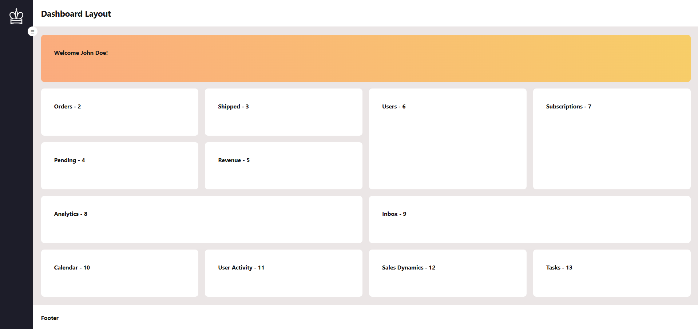

# iJunior-Dashboard-Responsive-Layout

## Table of Contents

- [Overview](#overview)
  - [Screenshot](#screenshot)
  - [Links](#links)
  - [Built With](#built-with)

### Screenshot

### Links

- Solution URL: [https://riquelme3m.github.io/iJunior-Dashboard-Grid-Layout/](https://riquelme3m.github.io/iJunior-Dashboard-Grid-Layout/)

### Built With

- Semantic HTML5 markup
- CSS custom properties
- CSS Grid
- Mobile First Development
- Responsive Web Design
